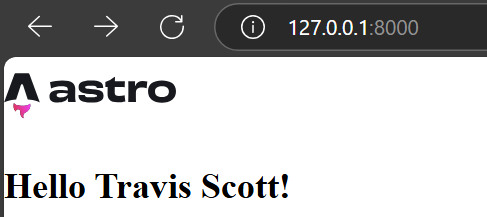

# Astro-Rust
Example of serving Astro generated HTML as a Rinja template for server-side
dynamic data injection.



Build the client:
```bash
cd frontend
npm install
npm run build
```

Start the server on port :8000:
```bash
cd ..
cargo r
```

Inspired by [Go Templates with
Astro](https://www.wingravity.com/blog/go-templates-with-astro)